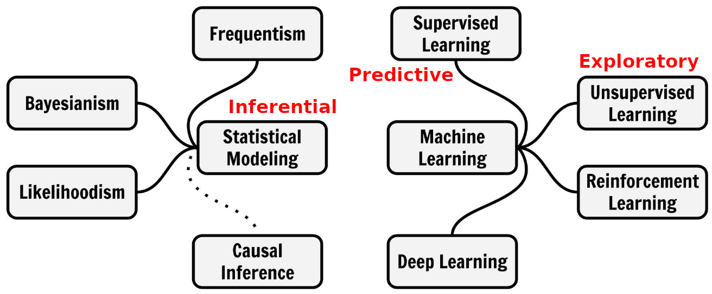

## Preliminary

```{r}
#| echo: true
library(tidyverse)
library(readxl)
library(tidymodels)
library(palmerpenguins)
library(patchwork)
```

# Final Project {background-color=khaki}


## A project report in a nutshell  {background-color=khaki}

- You pick a dataset, 
- do some interesting question-driven data analysis with it, 
- write up a well structured and nicely formatted report about the analysis, and 
- present it at the end of the semester. 


## Six types of questions {.smaller background-color=khaki}

:::: {.columns}

::: {.column width='60%'}
1.  **Descriptive:** summarize a characteristic of  data
2.  **Exploratory:** analyze to see if there are patterns, trends, or relationships between variables (hypothesis generating)
3.  **Inferential:** analyze patterns, trends, or relationships in representative data from a population
4.  **Predictive:** make predictions for individuals or groups of individuals
5.  **Causal:** whether changing one factor will change another factor, on average, in a population
6.  **Mechanistic:** explore "how" as opposed to whether
:::

::: {.column width='40%'}

:::

::::

:::{.aside}
Leek, Jeffery T., and Roger D. Peng. 2015. “What Is the Question?” Science 347 (6228): 1314–15. <https://doi.org/10.1126/science.aaa6146>.
:::

## What are good questions? {.smaller background-color=khaki}

A good question

- is not too broad (= complicated to answer)
- is not too specific (= trivial to answer)
- can be answered or at least approached with data
- call for one of the different types of data analysis: 
    - descriptive
    - exploratory
    - inferential
    - predictive
    - (causal or mechanistic -- not the typical choices for a short term data analysis projects. They should not be central but may be touched.)


## Tools and advice for questions {.smaller background-color=khaki}

:::: {.columns}

::: {.column width='50%'}
[**Descriptive**]{style='color:blue;'}

::: {.fragment}
- What is an observation? [Answer this in any data analysis!]{style='color:red;'}
- What are the variables?
- Summary statistics and basic visualizations
- Category frequencies and numerical distributions
:::
:::

::: {.column width='50%'}
[**Exploratory**]{style='color:blue;'}

::: {.fragment}
- Questions specific to the topic
- Compute/summarize relevant variables: percentages, ratios, differences, ...)
- Scatter plots
- Correlations
- Cluster Analysis
- **Crafted computations and visualizations for your particular questions**
:::
:::

::::


## Tools and advice for questions {.smaller background-color=khaki}

:::: {.columns}

::: {.column width='50%'}
[**Inferential**]{style='color:blue;'}

::: {.fragment}
- Describe the population the data represents
- Can it be considered a random sample?
- Think theoretically about variable selection and data transformations
- Interpret coefficients of models
- Be careful interpreting coefficients when variables are highly correlated
- Are effects statistical significant?
- Hypothesis test: Describe null distribution
:::
:::

::: {.column width='50%'}
[**Predictive**]{style='color:blue;'}

:::{.fragment}
- Regression or classification?
- Do a train/test split to evaluate model performance (Optional, do crossvalidation) 
- Select sensible performance metrics for the problem (from confusion matrix or regression metrics)
- Maybe compare different models and tune hyperparameters
- Do feature selection and feature engineering to improve the performance!
:::
:::
::::


# Modeling Mindsets

{height=300}

Some methods:  
**Linear Model:** [Inferential]{style='color:red;' .fragment} [and Predictive!]{style='color:red;' .fragment}  
**Logistic Regression:** [Inferential]{style='color:red;' .fragment} [and Predictive!]{style='color:red;' .fragment}  
**k-means Clustering:** [Exploratory]{style='color:red;' .fragment}

[**Let's check your questions in the Course Organization Repo!**]{style='color:blue;' .fragment}


# Hypothesis testing
Large part of the content adapted from <http://datasciencebox.org>.


## Organ donors {.smaller}

**Background story:** People providing an organ for donation sometimes seek the help of a special "medical consultant". These consultants assist the patient in all aspects of the surgery, with the goal of reducing the possibility of complications during the medical procedure and recovery. Patients might choose a consultant based in part on the historical complication rate of the consultant's clients. 

. . . 

**Example track record:** One consultant tried to attract patients by noting that the average complication rate for liver donor surgeries in the US is about 10%, but her clients have only had 3 complications in the 62 liver donor surgeries she has facilitated. She claims this is strong evidence that her work meaningfully contributes to reducing complications (and therefore she should be hired!).

. . . 

[Is this strong evidence for a good track record?]{style='color:red;'}

## Data {.smaller}

```{r}
#| echo: true
organ_donor <- tibble(
  outcome = c(rep("complication", 3), rep("no complication", 59))
)
```

```{r }
#| echo: true
organ_donor |>
  count(outcome)
```


## Parameter vs. statistic {.smaller}

A **parameter** for a hypothesis test is the "true" value of interest. We typically estimate the parameter using a **sample statistic** as a **point estimate**.

$q$: true rate of complication, here 0.1 (10% complication rate in US)

$\hat{q}$: rate of complication in the sample = $\frac{3}{62}$ = 
`r round(3/62, 3)` (This is the point estimate.)


## Correlation vs. causation  {.smaller}

**Is it possible to infer the consultant's claim using the data?**

No. The claim is: *There is a causal connection*. However, the data are observational.
For example, maybe patients who can afford a medical consultant can afford better medical care, which can also lead to a lower complication rate (for example).

. . .

**What is possible?**

While it is not possible to assess the causal claim, it is still possible to test for an association using these data. For this question we ask, **could the low complication rate of $\hat{q}$ = `r round(3/62, 3)` be due to chance?**


## Two claims

- [**Null hypothesis $H_0$:**]{style='color:blue;'} "There is nothing going on"

Complication rate for this consultant is no different than the US average of 10%

- [**Alternative hypothesis $H_1$:**]{style='color:blue;'} "There is something going on"

Complication rate for this consultant is **lower** than the US average of 10%


## Understand hypothesis testing as a court trial {.smaller}

- **Null hypothesis**, $H_0$: Defendant is innocent
- **Alternative hypothesis**, $H_A$: Defendant is guilty


- **Present the evidence:** Collect data

- **Judge the evidence:** "Could these data plausibly have happened by chance if the null hypothesis were true?"
    * Yes: Fail to reject $H_0$
    * No: Reject $H_0$
    

## Hypothesis testing framework {.smaller}

- Start with a null hypothesis, $H_0$, that represents the status quo

- Set an alternative hypothesis, $H_A$, that represents the research question, i.e. what we are testing for

- Conduct a hypothesis test under the assumption that the null hypothesis is true and calculate a **p-value**.    
**Definition p-value:** *Probability of observed or more extreme outcome given that the null hypothesis is true.*
    - if the test results suggest that the data do not provide convincing evidence for the alternative hypothesis, stick with the null hypothesis
    - if they do, then reject the null hypothesis in favor of the alternative


## Setting the hypotheses {.smaller}

Which of the following is the correct set of hypotheses for the claim that the consultant has lower complication rates?

(a) $H_0: q = 0.10$; $H_A: q \ne 0.10$ 

(b) $H_0: q = 0.10$; $H_A: q > 0.10$ 

(c) $H_0: q = 0.10$; $H_A: q < 0.10$ 

(d) $H_0: \hat{q} = 0.10$; $H_A: \hat{q} \ne 0.10$ 

(e) $H_0: \hat{q} = 0.10$; $H_A: \hat{q} > 0.10$ 

(f) $H_0: \hat{q} = 0.10$; $H_A: \hat{q} < 0.10$ 

. . . 

(c) is correct.   
Hypotheses are about the true rate of complication $q$ not the observed ones $\hat{q}$


# Simulation for Hypothesis Testing

## Simulating the null distribution {.smaller}

Since $H_0: q = 0.10$, we need to simulate a null distribution where the probability of success (complication) for each trial (patient) is 0.10.

**How should we simulate the null distribution for this study using a bag of chips?**

- How many chips? [For example 10 which makes 10% choices possible]{.fragment style='color:red;'}
- How many colors? [2]{.fragment style='color:red;'}
- What should colors represent? ["complication", "no complication"]{.fragment style='color:red;'}
- How many draws?  [62 as the data]{.fragment style='color:red;'}
- With replacement or without replacement? [With replacement]{.fragment style='color:red;'}

When sampling from the null distribution, what would be the expected proportion of "complications"?  [0.1]{.fragment  style='color:red;'}


## Simulation! {.smaller}

```{r}
#| echo: true
set.seed(1234) # The seed is set for the sake of stable presentation outcomes.
outcomes <- c("complication", "no complication")
sim1 <- sample(outcomes, size = 62, prob = c(0.1, 0.9), replace = TRUE)
sim1
sum(sim1 == "complication") / 62
```

Oh OK, this was exactly the consultant's rate. But maybe it was a rare event? Let us repeat it. 

## More simulation! {.smaller}

```{r}
#| echo: true
one_sim <- function() {
  sample(outcomes, size = 62, prob = c(0.1, 0.9), replace = TRUE)
}

sum(one_sim() == "complication") / 62
sum(one_sim() == "complication") / 62
sum(one_sim() == "complication") / 62
sum(one_sim() == "complication") / 62
sum(one_sim() == "complication") / 62
sum(one_sim() == "complication") / 62
sum(one_sim() == "complication") / 62
```


## Automating with `tidymodels`^[Of course, you can also do it in your own way without packages.] {.smaller}


:::: {.columns}

::: {.column width='40%'}
```{r}
#| echo: true
organ_donor
```

:::

::: {.column width='60%'}

```{r}
#| echo: true
set.seed(10)
null_dist <- organ_donor |>
  specify(response = outcome, success = "complication") |>
  hypothesize(
    null = "point",
    p = c("complication" = 0.10, "no complication" = 0.90)
  ) |>
  generate(reps = 100, type = "draw") |>
  calculate(stat = "prop")
null_dist
```

:::

::::


## Visualizing the null distribution {.smaller}

```{r}
#| echo: true
ggplot(data = null_dist, mapping = aes(x = stat)) +
  geom_histogram(binwidth = 0.01) +
  labs(title = "Null distribution")
```


# p-value

## Calculating the p-value, visually {.smaller}

**What is the p-value:** *How often was the simulated sample proportion at least as extreme as the observed sample proportion?*^[This a one-sided hypothesis test because we are looking for extremely lower rates not also extremely higher rates. We do one-sided test if we know the direction of interest, here "low" and "lower" rates.]

```{r}
#| echo: true
#| fig.height: 3
ggplot(data = null_dist, mapping = aes(x = stat)) +
  geom_histogram(binwidth = 0.01) +
  labs(title = "Null distribution") +
  geom_vline(xintercept = 3 / 62, color = "red")
```


## Calculating the p-value, directly

```{r}
#| echo: true
null_dist |>
  summarise(p_value = sum(stat <= 3 / 62) / n())
```

This is the fraction of simulations where complications was equal or below `r 3/62`. 


## Significance level  {.smaller}

- A **significance level** $\alpha$ is a threshold we make up to make our judgment about the plausibility of the null hypothesis being true given the observed data. 

- We often use $\alpha = 0.05 = 5\%$ as the cutoff for whether the p-value is low enough that the data are unlikely to have come from the null model. 

- If p-value < $\alpha$, reject $H_0$ in favor of $H_A$: The data provide convincing evidence for the alternative hypothesis.

- If p-value > $\alpha$, fail to reject $H_0$ in favor of $H_A$: The data do not provide convincing evidence for the alternative hypothesis.

**What is the conclusion of the hypothesis test?**

Since the p-value is greater than the significance level, we fail to reject the null hypothesis. 
These data do not provide convincing evidence that this consultant incurs a lower complication rate than the 10% overall US complication rate.

## 100 simulations is not sufficient {.smaller}

- We simulate 15,000 times to get an accurate distribution.

```{r}
#| echo: true
null_dist <- organ_donor |>
  specify(response = outcome, success = "complication") |>
  hypothesize(
    null = "point",
    p = c("complication" = 0.10, "no complication" = 0.90)
  ) |>
  generate(reps = 15000, type = "simulate") |>
  calculate(stat = "prop")
ggplot(data = null_dist, mapping = aes(x = stat)) +
  geom_histogram(binwidth = 0.01) +
  geom_vline(xintercept = 3 / 62, color = "red")
```


## Our more robust p-value 

For the null distribution with 15,000 simulations

```{r}
#| echo: true
null_dist |>
  filter(stat <= 3 / 62) |>
  summarise(p_value = n() / nrow(null_dist))
```

Oh OK, our first p-value was much more borderline in favor of the alternative hypothesis.

## p-value in model outputs {.smaller}

Model output for a linear model with palmer penguins.

```{r}
#| echo: true
linear_reg() |>
  set_engine("lm") |>
  fit(bill_length_mm ~ bill_depth_mm, data = penguins) |>
  tidy()
```

Model output for a logistic regression model with email from [openintro](https://www.openintro.org/data/index.php?data=email)

```{r}
#| echo: true
logistic_reg() |>
  set_engine("glm") |>
  fit(spam ~ from + cc, data = email, family = "binomial") |>
  tidy()
```

What do the p-values mean? What is the null hypothesis?

. . .

**Null-Hypothesis:** There is no relationship between the predictor variable and the response variable, that means that the coefficient is equal to zero. 

**Smaller p-value** $\to$ more evidence for rejecting the hypothesis that there is no effect. 

## xkcd on p-values {.smaller}

:::: {.columns}

::: {.column width='60%'}
[{height="500px"}](https://xkcd.com/1478/)
[{height="500px"}](https://xkcd.com/882/)
:::

::: {.column width='40%'}
:::{.fragment}
- Significance levels are fairly arbitrary. Sometimes they are used (wrongly) as definitive judgments
- They can even be used to do *p-hacking*: Searching for "significant" effects in observational data
- In parts of science it has become a "gamed" performance metric.
- The p-value says nothing about effect size!
:::
:::

::::

## p-value misinterpretation {.smaller}

p-values do not measure^[From the American Statistical Association (ASA) 2016]

- the probability that the studied hypothesis is true
- the probability that the data were produced by random chance alone
- the size of an effect
- the "importance of a result" or "evidence regarding a model or hypothesis" (it is only against the null hypothesis).

. . .

Correct:   
The p-value is the probability of obtaining test results at least as extreme as the result actually observed, under the assumption that the null hypothesis is correct.

p-values and significance tests, when properly applied and interpreted, increase the rigor of the conclusions drawn from data.^[From the American Statistical Association (ASA) 2019]


# Collaborative Work with Git

Learning goal: First experiences with collaborative data science work with `git`


## Step 1: git clone *project-Y-USERNAMES* {.smaller}


[Team formation is mostly complete.]{style='color:blue;'} 
Repositories `project-1`, `FinalProject_2`, ... are created. **You are to deliver your project reports in your repository.**

- Find your project repository 
- Copy the URL   
  {height=150}
- Go to RStudio
  - New Project > Form Version Control > Git > Paste your URL
  - The project is created


## Step 2: First Team member commits and pushes {.smaller}

**One team member does the following:**

- Open the file `report.qmd`
- Write your name in the first line at `author` in the YAML
- `git add` the file `report.qmd`
- `git commit` (enter "Added name" as commit message)
- `git push`
  
  
## Step 3: Other team members pull {.smaller}

- Do `git pull` in the RStudio interface. 


:::: {.columns}

::: {.column width='60%'}
**What does `git pull` do?**

- `git pull` does two things: fetching new stuff and merging it with existing stuff
    1. First it `git fetch`s the commit from the remote repository (GitHub) to the local machine
    2. Then it `git merge`s the commit with the latest commit on your local machine. 
- When we are lucky this works with no problems. (Should be the case with new files.)
:::

::: {.column width='40%'}


Source: <https://mastodon.social/@allison_horst/109303149552034159>
:::

::::


## Step 4: Merge independent changes {.smaller}

[Git can merge changes in the same file when there are no conflicts.]{style='color:blue;'} Let's try. 

- **The second team member:**
  - Add your name in the author section of the YAML, save the file, add the file in the Git pane and make a commit. 
  - Save, add the file in the Git pane, commit with message "Next author name", **push.**
- **The third (or first) team member:**
  - Change the title in the YAML to something meaningful (and also add your name if third team member), save the file, add the file in the Git pane and make a commit.
  - Try to **push**. You should receive an error. Read it carefully, often it tells you what to do. Here: Do `git pull` first. You cannot push because remotely there is a newer commit (the one your colleague just made).
  - **Pull.** This should result in message about a **successfull auto-merge**. Check that **both** are there: Your line and the line of your colleague.
  *If you receive several hints instead, first read the next slide!*


## ??? `git` configuration for divergent branches {.smaller}

:::: {.columns}

::: {.column width='50%'}
If you pull for the first time in a local git repository, git may complain like this: 

{height=200}

Read that carefully. It advises to configure with `git config pull.rebase false` as the default version. 
:::

::: {.column width='50%'}

**How to do the configuration?**

- Copy the line `git config pull.rebase false` and close the window.
- Go to the Terminal pane (not the console, the one besides that). This is a terminal not for R but to speak with the computer in general. Paste the command and press enter. Now you are done and your next `git pull` should work.
:::

::::

:::{.aside}
What is a *branch* and what a *rebase*? These are features of git well worth to learn but not now. Learn at <http://happygitwithr.com>
:::


## Step 5: Push and pull the other way round {.smaller}

- **The third/first member:**
  - The successful merge creates a new commit, which you can directly push. 
  - **Push.**
- **The second team member (and all others):** 
  - **Pull** the changes of your colleague. 
  
Practice a bit more pulling and pushing commits and check the merging. 


## Step 6: Create a merge conflict {.smaller}

- First and second team members: 
  - Write a different sentence after "Executive Summary." in YAML `abstract:`.
  - Each `git add`  and `git commit` on local machines. 
- First member: `git push`
- Second member: 
  - `git pull`. That should result in a conflict. *If you receive several hints instead, first read the slide two slides before!*
  - The conflict should show directly in the file with markings like this
  
`>>>>>>>>`   
one option of text,   
`========` a separator,    
the other option, and     
`<<<<<<<`. 

## Step 7: Solve the conflict {.smaller}

- The second member
  - You have to solve this conflict now!
  - Solving is by editing the text
  - Decide for an option or make a new text
  - Thereby, remove the `>>>>>`,`=====`,`<<<<<<`
  - When you are done: `git add`, `git commit`, and `git push`. 

Now you know how to solve merge conflicts. Practice a bit in your team. 

**Working in VSCode:** The workflow is the same because it relies on git not on the editor of choice. 
    
## Advice: Collaborative work with git {.smaller}

- Whenever you start a work session: First **pull** to see if there is anything new. That way you reduce the need for merges. 
- Inform your colleagues when you pushed new commits. 
- Coordinate the work, e.g. discuss who works on what part and maybe when. However, git allows to also work without full coordination and in parallel. 
- When you finish your work session, end with pushing a *nice* commit. That means. The file should render. You made comments when there are loose ends and todo's. 
- You can also use the *issues* section of the GitHub repository for things to do. 
- When you work on different parts of the file, be aware that also a successful merge can create problems. Example: Your colleague changed the data import, while you worked on graphics. Maybe after the merge the imported data is not what you need for your chunk. Then coordinate.  
- Commit and push often. This avoids that potential merge conflicts become large. 


# Bootstrapping

## Purpose: Quantify uncertainty {.smaller}

- **Uncertainty** is a central concern in **inferential data analysis**. 
- We want to **estimate** a **parameter** of a **population** from a **sample**.

. . .

Central inferential assumption: 

- Our data is a **random sample** from the **population** we are interested in. 
    - No **selection biases**.

Examples:

- We want to know **average height** of **all people** but we only have a sample of people. 
- We want know the **mean estimate** of all possible participants of the ox meat weigh guessing competition from the **sample ballots** of participants we have.
- We want to learn something about penguins from the data of the penguins in `palmerpenguins::penguins`

## Practical example: Galton's Data {.smaller}

Competition: Guess the weight of the meat of an Ox? (Galton, 1907)

*What is the mean of all possible participants $\mu$?* 

. . . 

```{r}
#| echo: true
#| fig-height: 2
galton <- read_csv("data/galton.csv")
galton |> ggplot(aes(Estimate)) + geom_histogram(binwidth = 5)
```

The (arithmetic) mean of the `r nrow(galton)` estimates is $\hat\mu =$ `r round(mean(galton$Estimate), digits = 2)`. 

*How sure can we be that $\hat\mu$ is close to $\mu$ and how can we quantify?*^[We already assume that we have an unbiased sample of all possible participants!]

## Practical example: Palmer Penguins {.smaller}

A linear model for body mass of penguins: $y_i = \beta_0 + \beta_1 x_i + \dots + \beta_m x_m  + \varepsilon_i$.

. . .

```{r}
#| echo: true
peng_workflow <- workflow() |> add_recipe(recipe(body_mass_g ~ ., data = penguins) |> step_rm(year)) |> 
  add_model(linear_reg() |> set_engine("lm"))
peng_fit <- peng_workflow |> fit(data = penguins)
peng_fit |> tidy() |> mutate_if(is.numeric, round, 7)
```

. . . 

The column `estimate` shows the coefficients $\hat\beta_0, \hat\beta_1, \dots, \hat\beta_m$ of the linear model for the variables named in `term`

*How sure can we be that the $\hat\beta$'s are close to the $\beta$'s we are interested in?*^[We already assume that we have an unbiased sample of all penguins!]

## Bootstrapping^[The name comes from the saying "pull oneself up by one's bootstrap". It refers to the somehow *magical* idea that we can use our small sample to *mimic* the whole population.] idea {.smaller}

1. Take a **bootstrap sample**: a random sample taken with replacement from the original sample with the same size. 
2. Calculate the *statistics* for the bootstrap sample. 
3. Repeat steps 1. and 2. many times to create a **bootstrap distribution** - a distribution of bootstrap statistics
4. Use the bootstrap distribution to quantify the uncertainty. 

What is the statistic in the Galton example? [The mean]{.fragment}   
What are the statistics in the penguins example? [The coefficients]{.fragment}

## Bootstrapping in practice {.smaller}

- You can do the bootstrapping procedure in various ways (including programming in base R or python). 
- We will use convenient functions from `rsample` form the `tidymodels` packages.

## Resamplings: Galton's Data {.smaller}

:::: {.columns}

::: {.column width='35%'}
The function `sample` selects `size` random elements from a vector `x` with or without `replace`. 

```{r}
#| echo: true
set.seed(224)
sample(galton$Estimate, size = 3, replace = TRUE)
sample(galton$Estimate, size = 3, replace = TRUE)
```

For tibbles we can use `slice_sample`.

```{r}
#| echo: true
galton |> slice_sample(n = 3, replace = TRUE)
```
:::

::: {.column width='35%'}
::: {.fragment}
A **bootstrap sample** is with replace and of the same size as the original sample: 

```{r}
#| echo: true
nrow(galton)
galton |> slice_sample(n = 787, replace = TRUE)
```
:::
:::

::: {.column width='30%'}
::: {.fragment}
Do some mean bootstrapping manually:

```{r}
#| echo: true
galton |> slice_sample(n = 787, replace = TRUE) |> 
 summarize(mean(Estimate))
galton |> slice_sample(n = 787, replace = TRUE) |> 
 summarize(mean(Estimate))
galton |> slice_sample(n = 787, replace = TRUE) |> 
 summarize(mean(Estimate))
```
:::
:::

::::

## Bootstrap set: Galton's Data {.smaller}

The function `bootstraps` from `rsample` does this type of bootstrapping for us. 

:::: {.columns}

::: {.column width='50%'}
1,000 resamples:

```{r}
#| echo: true
boots_galton <- galton |> bootstraps(times = 1000)
boots_galton
```

The column `splits` contains a list of split objects. 

```{r}
#| echo: true
boots_galton$splits[[1]]
```
:::

::: {.column width='50%'}
::: {.fragment}
From each split we can extract the bootstrapped resample with `analysis`. 
```{r}
#| echo: true

boots_galton$splits[[1]] |> analysis()
```

(The `assessment` set contains the observations that were not selected randomly in the resample. We do not use it in the following.)
:::
:::

::::

## Bootstrap distribution: Galton's Data {.smaller}

:::: {.columns}

::: {.column width='50%'}
We iterate with a `map` function^[Here we use `map_dbl` which iterates over the list of splits and reports the values as a vector of doubles (numbers), the default of `map` would be to report also a list.] over the splits and extract the analysis set and calculate the mean. 

```{r}
#| echo: true

boots_galton_mean <- boots_galton |> 
  mutate(
   mean = map_dbl(splits, 
                  \(x) analysis(x)$Estimate |> mean()))
boots_galton_mean
```
:::

::: {.column width='50%'}
::: {.fragment}
Plot the bootstrap distribution of the mean. 

```{r}
#| echo: true
#| fig.height: 2
boots_galton_mean |> 
 ggplot(aes(x = mean)) + geom_histogram() +
 theme_minimal(base_size = 24)
```
:::

::: {.fragment}
Compare distribution of estimates
```{r}
#| echo: true
#| fig.height: 2
galton |> ggplot(aes(Estimate)) + geom_histogram(binwidth = 5) +
 theme_minimal(base_size = 24)
```
:::
:::

::::

## Quantify uncertainty? Standard error {.smaller}

Compute the standard deviation of the bootstrap distribution. 

```{r}
#| echo: true
sd(boots_galton_mean$mean)
```

. . . 

The standard deviation of the bootstrap distribution is called the **standard error** of the statistic.

[Do not confuse standard error (of a statistic) and standard deviation (of a variable).]{style='color:red;'}

The **standard error of the mean** can also be estimated directly from the original sample $x$ as $\frac{\text{sd}(x)}{\sqrt{n}}$ where $n$ is the sample size. 

```{r}
#| echo: true
sd(galton$Estimate) / sqrt(nrow(galton))
```

. . . 

[Insight:]{style='color:blue;'} The standard error decreases with sample size! However, it decreases only with the square root of the sample size.

[Question:]{style='color:blue;'} You want to shrink the standard error by half. How much larger does the sample size need to be? [4 times]{.fragment}

## Confidence interval {.smaller}

Another way to quantify uncertainty is to compute a **confidence interval** (CI) for a certain **confidence level**:   
The true value of the statistic is expected to lie with the CI with certain probability (the confidence level).

. . .

:::: {.columns}

::: {.column width='30%'}
Compute the 95% confidence interval of the bootstrap distribution with `quantile`-functions:

```{r}
#| echo: true
boots_galton_mean |> 
  summarize(
    lower = quantile(mean, 0.025),
    upper = quantile(mean, 0.975))
```
:::

::: {.column width='60%'}
::: {.fragment}
```{r}
#| echo: true
boots_galton_mean |> 
 ggplot(aes(x = mean)) + geom_histogram() +
 geom_vline(xintercept = quantile(boots_galton_mean$mean, 0.025), color = "red") +
 geom_vline(xintercept = quantile(boots_galton_mean$mean, 0.975), color = "red") +
 annotate("text", x = 1197, y = 10, label = "95% of estimates", color = "white", size = unit(12, "pt")) +
 theme_minimal(base_size = 24)
```
:::
:::

::::

## Confidence Interval: Meaning {.smaller}

```{r}
#| echo: true
boots_galton_mean |> 
  summarize(
    lower = quantile(mean, 0.025),
    upper = quantile(mean, 0.975))
```

What is the correct interpretation? 

1. 95% of the estimates in this sample lie between 1191 and 1202.
2. We are 95% confident that the mean estimate of all potential participants is between 1191 and 1202.
3. We are 95% confident that the mean estimate of this sample is between 1191 and 1202.

. . . 

Correct: 2.  
1. The confidence is about a parameter (here the population mean) not about sample values!  
3. We know the mean of the sample precisely!   
The confidence interval assesses where 95% of the values are when do new samples.   

## CI: Precision vs. Confidence {.smaller}

- Can't we increase the confidence level to 99% to get a more precise estimate with a more narrow confidence interval?

. . . 

```{r}
#| echo: true
boots_galton_mean |> 
  summarize(
    lower = quantile(mean, 0.005),
    upper = quantile(mean, 0.995))
```

[No, it is the other way round:]{style='color:red;'} The smaller and more precise the confidence interval, the lower must the confidence level be.


## Bootstrap linear model coefficients {.smaller}  

```{r}
#| echo: true
peng_workflow <- workflow() |> add_recipe(recipe(body_mass_g ~ ., data = penguins) |> step_rm(year)) |> 
  add_model(linear_reg() |> set_engine("lm"))
peng_fit <- peng_workflow |> fit(data = penguins)
peng_fit |> tidy() |> mutate_if(is.numeric, round, 7)
```

. . .

Let us now bootstrap whole models instead of just mean values!

```{r}
#| echo: true

# A function to fit a model to a bootstrap sample and tidy the coefficients
fit_split <- function(split) peng_workflow |> fit(data = analysis(split)) |> tidy() 
# Make 1000 bootstrap samples and fit a model to each
boots_peng <- bootstraps(penguins, times = 1000) |> 
  mutate(coefs = map(splits, fit_split))
```

## Bootstrap data frame {.smaller .scrollable}

Now we have a column `coefs` with a list of data frames, each containing the fitted coefficients.  

```{r}
#| echo: true
boots_peng
```

We can `unnest` the list column to make a much longer but unnested data frame:

```{r}
#| echo: true
boots_peng |> unnest(coefs)
```

## Some coefficient distributions {.smaller}

```{r}
#| echo: true
#| fig.width: 18
g1 <- boots_peng |> unnest(coefs) |> filter(term == "islandDream") |> 
  ggplot(aes(x = estimate)) + geom_histogram() + xlab("coefficients islandDream") +
  geom_vline(xintercept = 0, color = "gray") + theme_minimal(base_size = 24)
g2 <- boots_peng |> unnest(coefs) |> filter(term == "bill_length_mm") |> 
  ggplot(aes(x = estimate)) + geom_histogram() + xlab("coefficients bill_length_mm") +
  geom_vline(xintercept = 0, color = "gray") + theme_minimal(base_size = 24)
g3 <- boots_peng |> unnest(coefs) |> filter(term == "flipper_length_mm") |> 
  ggplot(aes(x = estimate)) + geom_histogram() + xlab("coefficients flipper_length_mm") +
  geom_vline(xintercept = 0, color = "gray") + theme_minimal(base_size = 24)
g1 + g2 + g3
```

- We could derive *bootstrapped p-values* from these distributions.


## computed p-values from each fit {.smaller}

- Each bootstrap fit also delivers computed p-values for each coefficient.^[These are computed based on theoretical assumptions with the help of t-tests and t-distributions.]

```{r}
#| echo: true
#| fig.width: 18
#| fig.height: 4
g1 <- boots_peng |> unnest(coefs) |> filter(term == "islandDream") |> ggplot(aes(x = p.value)) + geom_histogram() + xlab("coefficients islandDream") + theme_minimal(base_size = 24)
g2 <- boots_peng |> unnest(coefs) |> filter(term == "bill_length_mm") |> ggplot(aes(x = p.value)) + geom_histogram() + xlab("coefficients bill_length_mm") + theme_minimal(base_size = 24)
g3 <- boots_peng |> unnest(coefs) |> filter(term == "flipper_length_mm") |> ggplot(aes(x = p.value)) + geom_histogram() + xlab("coefficients flipper_length_mm") + theme_minimal(base_size = 24)
g1 + g2 + g3
```

- computed p-values in resamples vary widely (see `islandDream`) when *bootstrapped p-values* show insignificance.


# Another resampling method


## How to evaluate performance on training data only? {.smaller}

- Model performance changes with the random selection of the training data. How can we then reliably compare models?
- Anyway, the training data is not a good source for model performance. It is not an independent piece of information. Predicting the training data only reveals what the model already "knows". 
- Also, we should save the testing data only for the final validation, so we should not use it systematically to compare models.

A solution: **Cross validation**

## Cross validation {.smaller}

More specifically, **$v$-fold cross validation**:

- Shuffle your data and make a partition with $v$ parts
  - Recall from set theory: A **partition** is a division of a set into mutually disjoint parts which union cover the whole set. Here applied to observations (rows) in a data frame.
- Use 1 part for validation, and the remaining $v-1$ parts for training
- Repeat $v$ times

## Cross validation


# Wisdom of the crowd, Bias and Diversity

## Galton's data {.smaller}

*What is the weight of the meat of this ox?*

```{r}
#| echo: true
#| fig-height: 2.5
galton <- read_csv("data/galton.csv")
galton |> ggplot(aes(Estimate)) + geom_histogram(binwidth = 5) + geom_vline(xintercept = 1198, color = "green") + 
 geom_vline(xintercept = mean(galton$Estimate), color = "red")
```

`r nrow(galton)` estimates, [true value]{style="color:green;"} 1198, [mean]{style="color:red;"} `r round(mean((galton$Estimate)), digits=1)`

::: aside
We focus on the arithmetic mean as aggregation function for the wisdom of the crowd here. 
:::


## RMSE Galton's data {.smaller}

Describe the estimation game as a predictive model:

- All *estimates* are made to predict the same value: the truth. 
  - In contrast to the regression model, the estimate come from people and not from a regression formula.
- The *truth* is the same for all.
  - In contrast to the regression model, the truth is one value and not a value for each prediction

```{r}
#| echo: true
rmse_galton <- galton |> 
 mutate(true_value = 1198) |>
 rmse(truth = true_value, Estimate)
rmse_galton
```

<!-- ## Regression vs. crowd estimation {.smaller} -->

<!-- The linear regression and the crowd estimation problems are similar but not identical! -->

<!-- |Variable      | Linear Regression Model                       | Crowd estimation -->
<!-- |--------------|-----------------------------------------------|-------------------------------------------- -->
<!-- | $y_i$        | Data point of response variable               | True value, uniform for all estimators $y_i = y$ -->
<!-- | $\hat{y}_i$  | Predicted value $\hat{y}_i=b_0+b_1+x_1+\dots$ | Estimate of one estimator -->
<!-- | $\bar{y}$    | Mean of response variable                     | Mean of estimates  -->


## MSE, Variance, and Bias of estimates {.smaller}

In a crowd estimation, $n$ estimators delivered the estimates $\hat{y}_1,\dots,\hat{y}_n$. 
Let us look at the following measures

- $\bar{y} = \frac{1}{n}\sum_{i = 1}^n \hat{y}_i^2$ is the mean estimate, it is the aggregated estimate of the crowd

- $\text{MSE} = \text{RMSE}^2 = \frac{1}{n}\sum_{i = 1}^n (\text{truth} - \hat{y}_i)^2$
  
- $\text{Variance} = \frac{1}{n}\sum_{i = 1}^n (\hat{y}_i - \bar{y})^2$ 

- $\text{Bias-squared} = (\bar{y} - \text{truth})^2$ which is the square difference between truth and mean estimate. 

There is a mathematical relation (a math exercise to check):

$$\text{MSE} = \text{Bias-squared} + \text{Variance}$$

## Testing for Galton's data {.smaller}

$$\text{MSE} = \text{Bias-squared} + \text{Variance}$$

```{r}
#| echo: true
MSE <- (rmse_galton$.estimate)^2 
MSE
Variance <- var(galton$Estimate)*(nrow(galton)-1)/nrow(galton)
# Note, we had to correct for the divisor (n-1) in the classical statistical definition
# to get the sample variance instead of the estimate for the population variance
Variance
Bias_squared <- (mean(galton$Estimate) - 1198)^2
Bias_squared

Bias_squared + Variance
```

::: aside
Such nice mathematical properties are probably one reason why these squared measures are so popular. 
:::


## The diversity prediction theorem^[Notion from: Page, S. E. (2007). The Difference: How the Power of Diversity Creates Better Groups, Firms, Schools, and Societies. Princeton University Press.] {.smaller}

- *MSE* is a measure for the average **individuals error**
- *Bias-squared* is a measure for the **collective error**
- *Variance* is a measure for the **diversity** of estimates around the mean estimate

The mathematical relation $$\text{MSE} = \text{Bias-squared} + \text{Variance}$$ can be formulated as 

**Collective error = Individual error - Diversity**

Interpretation: *The higher the diversity the lower the collective error!*


## Why is this message a bit suggestive? {.smaller}

The mathematical relation $$\text{MSE} = \text{Bias-squared} + \text{Variance}$$ can be formulated as 

**Collective error = Individual error - Diversity**

Interpretation: *The higher the diversity the lower the collective error!*

. . . 

- $\text{MSE}$ and $\text{Variance}$ are not independent! 
- Activities to increase diversity (Variance) typically also increase the average individual error (MSE).
- For example, if we just add more random estimates with same mean but wild variance to our sample we increase both and do not gain any decrease of the collective error.


## Accuracy for numerical estimate {.smaller}

- For binary classifiers **accuracy** has a simple definition: Fraction of correct classifications. 
  - It can be further informed by other more specific measures taken from the confusion matrix (sensitivity, specificity)

How about numerical estimators?   
For example outcomes of estimation games, or linear regression models? 

. . .

- Accuracy is for example measured by (R)MSE
- $\text{MSE} = \text{Bias-squared} + \text{Variance}$ shows us that we can make a  
**bias-variance decomposition**
- That means some part of the error is a systematic (the bias) and another part due to random variation (the variance).
- The bias-variance tradeoff is also an important concept in statistical learning! 


## 2-d Accuracy: Trueness and Precision {.smaller}

According to ISO 5725-1 Standard: *Accuracy (trueness and precision) of measurement methods and results - Part 1: General principles and definitions.* there are two dimension of accuracy of numerical measurement. 

 {height="300px"}


## What is a wise crowd? {.smaller}

Assume the dots are estimates. **Which is a wise crowd?**

{height="300px"}

. . . 

- Of course, high trueness and high precision! But, ...
- Focusing on the **crowd** being wise instead of its **individuals**: High trueness, low precision. 


# Bias-variance trade-off in a script

`penguins_bias_variance.R`


